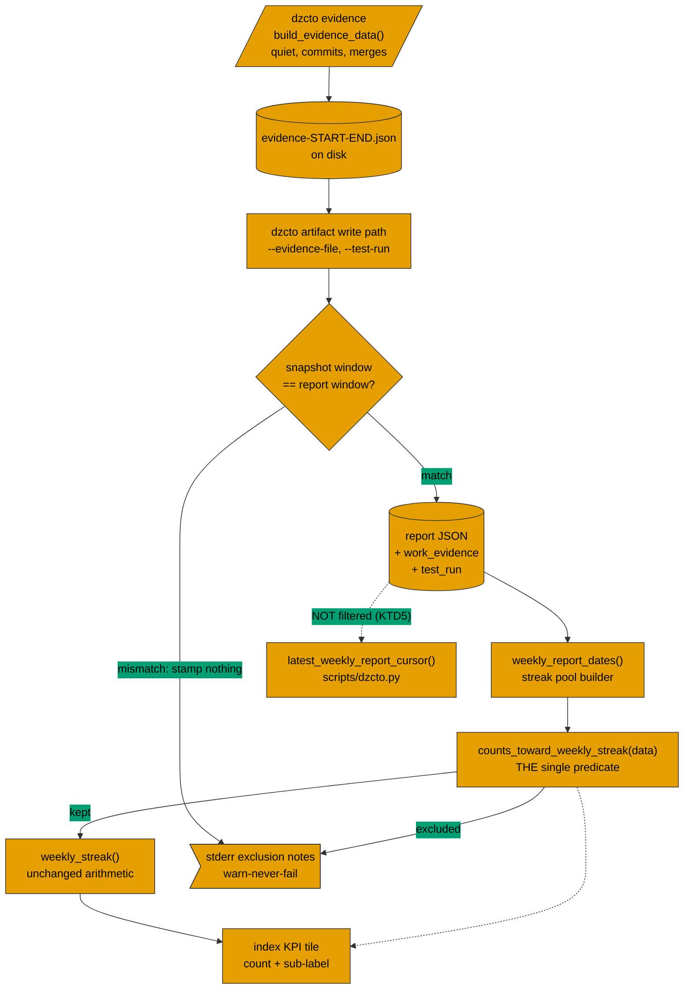

# DAYZEROCTO-15: Exclude no-work and discarded runs from the weekly streak

## Goal

Make the weekly streak trustworthy, visible, and defensible — the four issues in this group are one
piece of work on the North Star surface, so they share a branch, a plan, and a PR:

- **DAYZEROCTO-15** (primary) — count only weekly reports that carry positive evidence of work and
  were not marked test/debug runs, so the streak measures the ritual it claims to measure.
- **DAYZEROCTO-16** — surface the streak count in the CLI tail after a run, where the user actually
  finishes, instead of only on a page they must open.
- **DAYZEROCTO-17** — add a discreet Day Zero CTO credit to the shareable artifact, turning every
  shared report into a discovery surface for the project.
- **DAYZEROCTO-18** — warn while a period is still open that the streak is at risk, so a user can
  act before it silently resets.

The engineering shape throughout is the same one the repo already favours: a single predicate or
helper per fact, applied at the one dispatch point that already owns the surface.

---

## Problem Frame

`weekly_streak()` counts dates, and `weekly_report_dates()` builds that date pool from every
`report_type == "weekly"` JSON on disk. There is no eligibility filter beyond report type, so a
quiet week with zero commits and a maintainer's own test render both extend the streak exactly as a
genuine week of shipped work does. `docs/ceo-report-template.md` already asserts the intended
behavior in prose — "A quiet-week report preserves the reporting ritual; it does not count toward
the North Star streak" — so the documentation and the strategy already agree with each other, and
the code is the thing that lags.

There is a design tension this plan has to hold rather than resolve away. The product actively
*encourages* writing quiet-week reports: `PRODUCT_STRATEGY.md`'s "Ritual over highlights" principle
and both `SKILL.md` files tell the agent to prefer an honest quiet-week report over skipping the
week. This change makes those same reports stop extending the streak. The engineering response is
that the exclusion must be **legible, not punitive** — the operator has to be able to see *why* a
report they honestly filed did not count, and the index copy must read as "paused" rather than
"failed". That is what U3 and the stderr notes in U1/U2 exist for.

---

## Requirements Trace

The backlog issue `DAYZEROCTO-15` owns the acceptance criteria. This plan's engineering response
maps to them as:

- R1. A weekly report over a window with no actual work does not enter the streak pool. → U2
- R2. A test/debug run does not contribute to the streak, whether its artifact was deleted or is
  still on disk. → U1 (still-on-disk marker), U5 (characterization proof for the deleted case)
- R3. The exclusion is observable without reading the source: the operator can see which report was
  excluded and why, from CLI output and from the rendered index. → U1, U2, U3
- R4. Existing reports on disk must not silently lose their streak on upgrade. → U1 (predicate
  default), U5 (regression test)

---

## Scope Boundaries

- **Only two of the four strategy exclusions are in scope.** `PRODUCT_STRATEGY.md` names four North
  Star exclusions. This plan implements *test/debug runs whose artifact is discarded* and *runs over
  a window with no actual work*. The other two are explicitly **not** built here:
  - "automated runs whose report nobody opens do not count" — requires open/read telemetry the
    product does not collect and this plan does not add.
  - "the maintainer's own usage on his own projects does not count" — requires an identity or
    workspace-ownership concept the product does not have. Note that the `--test-run` marker in U1
    gives the maintainer a *manual* way to exclude his own renders; that is a side benefit, not an
    implementation of this exclusion.
- No changes to the streak arithmetic itself. `weekly_streak()`, `rounded_period_index()`, and the
  today-anchoring and cadence-bucketing semantics established in DAYZEROCTO-5 are untouched. This
  change only decides which dates enter the pool.
- No changes to prior-report selection (`locate_prior_report`) or to the since-last-report coverage
  cursor (`latest_weekly_report_cursor` in `scripts/dzcto.py`). See KTD5 — this is a deliberate
  non-goal, not an oversight.
- No auto-created issues from audits and no scheduled recurring audits (carried from the issue's
  own Out-of-scope list).

---

## Context & Research

### Relevant Code and Patterns

- `scripts/dzcto_artifact.py` — `weekly_report_dates()` is the **single** streak-pool builder and
  has exactly one call site, `render_index()`. That makes it the correct and ripple-free place for
  the eligibility filter.
- `scripts/dzcto_artifact.py` — `cited_evidence_sources()` plus its thin-evidence banner is the
  in-repo reference implementation of "one predicate, N consumers." The new eligibility predicate
  should mirror its shape.
- `scripts/dzcto_artifact.py` — the write path stamps renderer-owned metadata (`schema_version`,
  `generated_at`, `company` via `setdefault`; `prior_report` via unconditional assignment) just
  before sanitize/validate. New renderer-owned facts belong in the same block. The `prior_report`
  precedent — unconditional assignment plus an explicit "do not author this" line in both
  `SKILL.md` files — is the one to copy, because the agent must not be able to influence its own
  streak eligibility.
- `scripts/dzcto.py` — `build_evidence_data()` already computes `"quiet": total_commits == 0` next
  to `totals.commits` / `totals.merges`, and `run_evidence()` persists the snapshot to
  `.dzcto/generated/evidence-<start>-<end>.json` (or `--output-json`). This is a real,
  already-computed, machine-generated no-work signal — it is the input this feature needs, and it
  already exists.
- `scripts/dzcto.py` — the `artifact` subcommand is a whitelisting wrapper, not a passthrough. New
  engine flags need three-site wiring.
- `scripts/dzcto_artifact.py` — `validate_ceo_report()`'s empty-content tripwire carries an explicit
  in-source comment saying it *cannot* distinguish an intentional quiet window from forgotten
  structure, and that carried-forward risks correctly suppress it. That comment is a direct warning
  against the "infer quiet from empty sections" approach; see KTD1's rejected alternatives.

### Institutional Learnings

- `docs/solutions/architecture-patterns/shared-predicate-guardrail-single-dispatch-point-2026-07-09.md`
  — the governing pattern for this change. One predicate, every consumer routed through it,
  centralized at the single dispatch point rather than sprayed across call sites. Verify the
  call-site invariant before centralizing; here it holds (one call site).
- `docs/solutions/architecture-patterns/helper-computes-agent-narrates-2026-07-03.md` — decides
  KTD1. Streak eligibility is checkable, therefore the helper computes it and the agent is
  forbidden from authoring it.
- `docs/solutions/design-patterns/today-anchored-cadence-period-streak-2026-07-09.md` — the streak's
  own design record. Two rules bind this work: "exclude by filtering, not by special-casing"
  (§5), and "every skip is silent-to-the-user (a stderr note at most) — the index write path is
  warn-never-fail, so one malformed report must never abort the render" (§4). Its testing traps
  section also warns that a subprocess CLI test cannot pin `today`; positive-streak assertions
  need the in-process date-pinned `render_index(..., today=...)` call.
- `docs/solutions/conventions/dzcto-engine-flag-three-site-wiring-2026-07-10.md` — both new flags
  must be declared in the engine argparse, re-declared on the `dzcto.py` wrapper subparser, and
  re-appended in the wrapper's arg-list rebuild. Miss one and the flag is silently dropped through
  the wrapper. Also: side-effect output goes to stderr, never stdout, because the skill parses the
  single stdout line for the report path.
- `docs/solutions/conventions/skill-md-schema-lockstep-test-2026-07-03.md` — the two `SKILL.md`
  "Report JSON schema (v1)" blocks are asserted byte-identical by a unit test. Any schema addition
  must land in both, identically.
- `docs/solutions/logic-errors/quiet-week-diff-fabricates-reversal-2026-07-09.md` — prior evidence
  that quietness has bitten this render path before; read before touching quiet-window handling.
- `docs/solutions/conventions/absence-proxy-assertions-break-on-additive-rendering-2026-07-23.md` —
  do not write index assertions that prove a state only by the *absence* of a string; additive
  rendering breaks them. Relevant to U3's KPI sub-label tests.

### External References

None. This is local logic over an existing schema and an existing evidence collector; no new
technology layer and no high-risk external domain.

---

## Key Technical Decisions

### KTD1 — Quiet-window detection is a renderer-stamped fact derived from the evidence snapshot, not agent-authored and not content-inferred

The renderer stamps a `work_evidence` object onto the weekly report JSON at write time, derived from
the machine-generated evidence snapshot the skill already produces in its step 4. The agent is a
courier for a file it did not author; the helper computes the verdict.

Rejected alternatives:

- **Agent authors a `quiet: true` field.** Violates helper-computes/agent-narrates: streak
  eligibility becomes self-reported by the party the metric measures. The agent would be scoring its
  own homework.
- **Infer quiet at render time from empty `progress`/`metrics`/`risks_blockers`.** The in-source
  comment on `validate_ceo_report()`'s tripwire already documents why this fails: it cannot
  distinguish an intentional quiet window from forgotten structure, and carried-forward risks
  suppress it. A quiet week that correctly carries forward still-true risks would look busy; a busy
  week whose agent forgot structure would look quiet. Both directions are wrong.
- **Renderer re-runs git itself at write time.** Duplicates work the skill already did, requires the
  evidence repos to be present and readable from the artifact command's context, and makes the
  stamped fact depend on repo state at render time rather than window time.
- **Renderer locates the snapshot by convention instead of taking a flag.** `run_evidence()` writes
  to `.dzcto/generated/evidence-<start>-<end>.json` by default, so the renderer could derive that
  path from the report's own `window` and skip the new CLI surface entirely. Tempting, and rejected:
  `--output-json` lets the caller redirect the snapshot anywhere, so the convention is not
  guaranteed; a *silently missing* file at a guessed path is indistinguishable from "no evidence
  collected", which is exactly the ambiguity KTD2's guard exists to remove; and an implicit
  filesystem dependency between two commands is far harder to test and to reason about than an
  explicit argument. Take the flag and let the caller name the file.
- **Recompute quietness at streak time, for every report, on every index render.** Non-deterministic
  over time (rebases and history rewrites change the answer for a window that already closed),
  slow, and impossible once the evidence repo is gone. Freezing the fact at write time is correct
  because "was there work in that window" is a fact about that moment.

### KTD2 — The evidence snapshot's window must match the report's window, or nothing is stamped

A stale or mismatched snapshot is the failure mode that would silently mark a busy week quiet. Stamp
only when the snapshot's `window.start`/`window.end` equal the report's. On mismatch, stamp nothing
and emit a stderr warning naming both windows. Absent-and-warned is strictly better than
present-and-wrong: an unstamped report keeps counting (KTD3), which is the conservative direction.

### KTD3 — An absent eligibility fact means the report counts

Every report already on disk lacks the new fields. Absence means "this report predates exclusion
tracking," not "this report had no work." Excluding on absence would retroactively zero every
existing user's streak on upgrade — converting a known over-count into a total loss of the North
Star signal, which is strictly worse than the bug being fixed.

This is a **deliberate asymmetry with `report_type`**, where absence *does* exclude. The two are
different questions: an untyped legacy report genuinely might not be a weekly report, so assuming
"weekly" would fabricate membership; whereas an unstamped report is definitely a weekly report whose
work level is merely unknown. The burden of proof sits on the side that removes something the user
earned — exclusion requires positive evidence.

### KTD4 — Two exclusion inputs, one predicate, three consumers

A single `counts_toward_weekly_streak(data) -> bool` predicate in `scripts/dzcto_artifact.py` is the
only place the policy lives. Its inputs are the two stamped facts (`work_evidence.quiet` and
`test_run`). Its consumers are the pool filter, the stderr exclusion note, and the index KPI
sub-label. Because all three read one function over the same report JSON, they cannot skew — the
`warn-but-shows` failure mode from the shared-predicate learning is unrepresentable.

The predicate returns a verdict plus a human-readable reason, so the stderr note and the KPI
sub-label can name *why* without re-deriving it. A small `(bool, str | None)` return or a tiny
result object is enough; the exact shape is an implementation detail.

### KTD5 — The exclusion applies to the streak pool ONLY, never to the coverage cursor

An excluded quiet week must still advance the since-last-report cursor. If it did not, the days it
covered would be re-reported in the next window and land in two reports — a correctness bug strictly
worse than an inflated streak.

This is structurally safe today: the cursor is `latest_weekly_report_cursor()` in `scripts/dzcto.py`
and is a *separate implementation* from `weekly_report_dates()` in `scripts/dzcto_artifact.py`. They
share an idiom, not a function, so the filter cannot leak. U5 pins this with a non-regression test
so that a future well-meaning "share the predicate between them" refactor fails loudly instead of
silently double-reporting days. Prior-report selection (`locate_prior_report`) is unaffected for the
same reason and for the same recorded reason: a quiet week is still the right narrative baseline to
diff the next week against.

### KTD6 — "Discarded" splits into an already-satisfied case and a real gap

- **Artifact genuinely deleted.** Already excluded by construction: `weekly_report_dates()` globs
  what is on disk, so a deleted report cannot enter the pool. This needs a **characterization test,
  not new code.** Building machinery for it would be machinery for a case that cannot occur.
- **Test/debug run left on disk.** This is the real gap and it needs a marker. Test-run intent is a
  *human* fact the agent cannot know, so the marker is an operator-set CLI flag (`--test-run`), not
  a JSON field the agent writes. It stamps `test_run: true` and the predicate excludes it.

Stating which half of the criterion is already met is part of the deliverable — it prevents the
implementer from inventing a deletion-tracking mechanism the product does not need.

### KTD7 — Store facts, derive the verdict; do not store a `counts_toward_streak` boolean

The stamped fields are observations (`work_evidence.quiet`, `work_evidence.commits`,
`work_evidence.merges`, `test_run`), not conclusions. Storing a baked verdict would freeze today's
policy into every report file, so a future policy change (adding a third exclusion, or softening
one) would require rewriting historical artifacts. Storing facts keeps policy in one predicate where
KTD4 can enforce single-source-of-truth.

---

## Open Questions

### Resolved During Planning

- **Where does the filter live?** `weekly_report_dates()` — the single pool builder with exactly one
  call site (`render_index`). The single-dispatch-point learning's load-bearing precondition
  (verify the call-site invariant before centralizing) was checked and holds.
- **Does the exclusion break the coverage cursor?** No — separate implementations. See KTD5, pinned
  by a test in U5.
- **How does the operator find out a report was excluded?** Three surfaces, one predicate: a
  write-time stderr note, an index-render stderr note matching the existing
  `dzcto: skipping weekly-streak candidate ...` convention, and the KPI sub-label. See KTD4 and U3.
- **Should the quiet fact be recomputed or frozen?** Frozen at write time. See KTD1's fourth
  rejected alternative.

Three scope additions surfaced during planning — two new CLI flags, a weekly-skill workflow change,
and the index KPI copy state — were recorded as a comment on `DAYZEROCTO-15` rather than written
into this plan as new acceptance criteria. The issue owns the business contract; see that comment
for the reasoning and for the two strategy exclusions deliberately left out of scope.

### Deferred to Implementation

- The exact stamped key names (`work_evidence` vs. a flatter shape) and the predicate's exact return
  type. Both are settled in principle by KTD4 and KTD7; the final naming should be chosen against
  the surrounding code once the implementer has the file open, and then reflected identically in
  `docs/ceo-report-template.md`, both `SKILL.md` schema blocks, and `README.md`.
- Whether the write-time stderr note for a quiet stamp should fire on every quiet report or only
  when the stamp actually changes streak eligibility. Depends on how noisy it reads against the
  existing thin-evidence warning, which is best judged by running it.
- The precise KPI sub-label wording in U3. The constraint (must read as paused, not failed) is
  fixed; the string is a copy decision better made against the rendered tile.

---

## High-Level Technical Design

> *This illustrates the intended approach and is directional guidance for review, not implementation
> specification. The implementing agent should treat it as context, not code to reproduce.*

Shapes carry the meaning, not colour: **parallelogram** = a command that emits data, **cylinder** =
data persisted on disk, **diamond** = a guard, **flag** = stderr output, **rectangle** = a function
or code path. The dashed edge into `CURSOR` marks the deliberate non-connection from KTD5 — the
coverage cursor reads the same report JSON but must never consult the predicate.

---

## Implementation Units

- U1. **Eligibility predicate, streak-pool filter, and the `--test-run` marker**

**Goal:** Establish the single predicate and the one dispatch point that uses it, and ship the first
exclusion input end to end: an operator can mark a render as a test run and watch it drop out of the
streak with a named reason.

**Requirements:** R2 (still-on-disk half), R3, R4

**Dependencies:** None

**Files:**
- Modify: `scripts/dzcto_artifact.py`
- Modify: `scripts/dzcto.py`
- Test: `tests/test_dzcto_artifact.py`

**Approach:**
- Add `counts_toward_weekly_streak(data)` near `weekly_report_dates()`, returning a verdict plus a
  human-readable exclusion reason. This is the only place the policy lives (KTD4).
- Default is **counts** when the eligibility facts are absent (KTD3). Write this as the predicate's
  explicit, commented default so a future reader does not "tidy" it into an exclusion.
- Wire the predicate into `weekly_report_dates()` alongside the existing `report_type` filter, and
  print the exclusion using the existing skip-note convention, e.g.
  `dzcto: excluding weekly-streak candidate <name> (<reason>)`. Warn-never-fail: an exclusion must
  never abort the index render.
- Add `--test-run` to the engine argparse in `scripts/dzcto_artifact.py`, stamping `test_run: true`
  onto the structured report JSON in the renderer-owned-metadata block. Then wire it through the
  other two CLI sites: the `artifact` subparser in `scripts/dzcto.py` and the arg-list rebuild in
  that file's `if args.command == "artifact":` dispatch.
- Emit the test-run stamp notice to stderr, never stdout — the skill parses the single stdout line
  for the report path.

**Patterns to follow:**
- `cited_evidence_sources()` in `scripts/dzcto_artifact.py` — one predicate, N consumers.
- The existing `dzcto: skipping weekly-streak candidate ...` stderr notes inside
  `weekly_report_dates()` — match their phrasing and their warn-never-fail posture.
- `docs/solutions/conventions/dzcto-engine-flag-three-site-wiring-2026-07-10.md` for the flag.

**Test scenarios:**
- Happy path: a weekly report with no eligibility fields at all is counted — the streak matches
  today's behavior exactly. (This is the R4 upgrade-safety guard; it must be an explicit test, not
  an assumed side effect.)
- Happy path: a weekly report with `test_run: true` is excluded from the pool, and a streak of three
  weeklies where the middle one is a test run reads as the correct broken-run value rather than 3.
- Happy path: `counts_toward_weekly_streak()` returns a reason string for an excluded report and no
  reason for a kept one.
- Edge case: `test_run: false` explicitly present is counted — the predicate keys off truthiness of
  the marker, not the presence of the key.
- Edge case: `test_run` present with a non-boolean value (string `"yes"`, `null`) does not raise;
  decide and pin one behavior.
- Error path: an unreadable or non-dict report JSON still hits the existing skip note and does not
  reach the predicate — the new filter must not change the existing tolerant-collector behavior.
- Integration: `dzcto artifact --test-run` through the `scripts/dzcto.py` wrapper (not just the
  engine directly) reaches the engine and stamps the field — this is the three-site-wiring
  regression, and testing only the engine would pass while the real user path is broken.
- Integration: `--test-run` output goes to stderr and the stdout line is still exactly the report
  path.

**Verification:**
- Rendering a workspace whose newest weekly is marked `--test-run` produces a streak that excludes
  it, and the run names the excluded file and reason on stderr.
- `python3 -m unittest discover -s tests` passes.

---

- U2. **Quiet-window detection from the evidence snapshot**

**Goal:** Ship the second exclusion input: a weekly report rendered against an evidence snapshot
showing no work in its window is stamped with that fact and drops out of the streak.

**Requirements:** R1, R3, R4

**Dependencies:** U1 (the predicate and its dispatch point must exist first)

**Files:**
- Modify: `scripts/dzcto_artifact.py`
- Modify: `scripts/dzcto.py`
- Test: `tests/test_dzcto_artifact.py`

**Approach:**
- Add `--evidence-file` to the engine argparse, wired through all three CLI sites exactly as U1 did
  for `--test-run`.
- In the renderer-owned-metadata block of the write path — beside where `schema_version`,
  `generated_at`, and `company` are stamped and before sanitize/validate — read the evidence
  snapshot and stamp `work_evidence` onto the structured report JSON. Assign unconditionally (the
  `prior_report` precedent), not via `setdefault`: the agent must not be able to pre-empt its own
  eligibility.
- Apply the KTD2 guard: stamp only when the snapshot's window equals the report's `window`. On
  mismatch, stamp nothing and warn on stderr naming both windows. On an unreadable or missing
  evidence file, stamp nothing and warn — never fail the render.
- Derive the stamped facts from the snapshot's existing keys (`quiet`, `totals.commits`,
  `totals.merges`). Do not re-derive quietness with a second rule; the collector already owns that
  definition and a second one would drift.
- Extend `counts_toward_weekly_streak()` with the quiet branch and its reason string. The predicate
  gains a branch; no new filter site appears.
- Update the weekly `SKILL.md` step-7 render command to pass `--evidence-file` with the snapshot
  path from its step 4. The ad-hoc skill does not pass it — ad-hoc reports are not in the weekly
  pool at all.
- **The snapshot path has to become knowable to the skill.** Step 4 currently calls
  `dzcto evidence ... --json`, and `run_evidence()` prints *either* the JSON (with `--json`) *or*
  the written path (without it) — so as written the skill never learns where the snapshot landed.
  Give step 4 an explicit `--output-json <path>` and have step 7 pass that same path to
  `--evidence-file`, rather than teaching the skill to reconstruct the default
  `.dzcto/generated/evidence-<start>-<end>.json` filename. An explicit path the skill chose is
  stable; a filename convention it has to rebuild is a second place for the naming rule to drift.

**Execution note:** Add the write-path stamping test before wiring the predicate branch, so the
"stamped but still counted" intermediate state is observable and the two halves cannot be confused
when one of them is wrong.

**Patterns to follow:**
- The `prior_report` unconditional-assignment precedent in the write path.
- `build_evidence_data()` in `scripts/dzcto.py` for the snapshot's key names — read them, do not
  restate them.

**Test scenarios:**
- Happy path: rendering with an evidence file whose `quiet` is true stamps `work_evidence` with
  `quiet: true` and zero commits, and the report is excluded from the streak pool.
- Happy path: rendering with an evidence file showing commits stamps `quiet: false` and the report
  counts.
- Happy path: an agent-authored `work_evidence` in the input JSON is overwritten by the
  renderer-computed value, not preserved.
- Edge case: no `--evidence-file` passed at all — nothing is stamped, the report counts, and the
  behavior is byte-identical to pre-change.
- Edge case (KTD2): the evidence file's window does not match the report's `window` — nothing is
  stamped, a stderr warning names both windows, and the report counts.
- Edge case: an evidence snapshot with zero configured repos (the collector's `note` path) — decide
  and pin whether that is "quiet" or "undetermined". Undetermined is the safe reading, since no
  repos means no evidence either way, and the KTD3 default then keeps the report counting.
- Error path: `--evidence-file` points at a missing file, or at unreadable/non-dict JSON — warn on
  stderr, stamp nothing, render successfully.
- Integration: `dzcto artifact --evidence-file ...` through the `scripts/dzcto.py` wrapper reaches
  the engine (three-site-wiring regression).
- Integration: a full evidence → artifact → index sequence over a temp workspace where the window
  had no commits produces a rendered index whose streak excludes that week.

**Verification:**
- A weekly rendered against a zero-commit snapshot for its own window does not extend the streak,
  and the exclusion reason names the quiet window on stderr.
- `python3 -m unittest discover -s tests` passes.

---

- U3. **Index KPI copy for the paused-but-honest state**

**Goal:** Make the exclusion legible on the rendered index so an operator who honestly filed a quiet
week sees "paused", not "you have no streak" — the visible half of R3, and the resolution of the
strategy tension named in the Problem Frame.

**Requirements:** R3

**Dependencies:** U1, U2

**Files:**
- Modify: `scripts/dzcto_artifact.py`
- Test: `tests/test_dzcto_artifact.py`

**Approach:**
- In `render_index()`, where `weekly_streak_sub` currently chooses between "Start a weekly report",
  "North Star met", and "of 3 - North Star", add the case where weekly reports exist on disk but the
  most recent ones were excluded. Route the reason through the same
  `counts_toward_weekly_streak()` predicate rather than re-deriving it — this is the third consumer
  from KTD4 and the reason the predicate returns a reason string.
- The copy must read as paused/not-counted rather than as failure, because the product asks the user
  to file the very report that triggered this state.
- The tile's `data-tone` should not read as an error state for an honestly-filed quiet week.

**Patterns to follow:**
- The existing `weekly_streak_sub` / `data-tone` branch structure at the KPI tile in
  `render_index()`.
- `docs/solutions/architecture-patterns/shared-predicate-guardrail-single-dispatch-point-2026-07-09.md`
  — this is a third consumer of the one predicate, not a fourth rule.

**Test scenarios:**
- Happy path: a workspace whose only weekly report is quiet-excluded renders a sub-label naming the
  paused state, not the "Start a weekly report" zero-state.
- Happy path: a workspace with three counting weeklies still renders "North Star met" — the new
  branch does not steal the existing cases.
- Edge case: a genuinely empty workspace with no weekly reports at all still renders "Start a weekly
  report".
- Edge case: pin the streak value with an in-process, date-pinned `render_index(..., today=...)`
  call, not through the subprocess CLI. The DAYZEROCTO-5 learning records that a subprocess test
  reads the wall clock and will correctly print `0` for past-dated fixtures — a positive-streak
  assertion there proves nothing.
- Integration: assert on the *presence* of the new sub-label string, never on the absence of another
  string; the absence-proxy learning records that additive rendering breaks absence assertions.

**Verification:**
- The rendered `index.html` for a quiet-excluded workspace visibly distinguishes "paused" from
  "never started".
- `python3 -m unittest discover -s tests` passes.

---

- U4. **Schema, documentation, and vocabulary wiring**

**Goal:** Land the new fields on every surface `report_type` reaches, so the contract the agent
reads, the doc a user reads, and the vocabulary the codebase shares all describe what actually
ships.

**Requirements:** R1, R2, R3

**Dependencies:** U1, U2 (field names must be settled before they are documented)

**Files:**
- Modify: `docs/ceo-report-template.md`
- Modify: `skills/dzcto-ceo-report-weekly/SKILL.md`
- Modify: `skills/dzcto-ceo-report/SKILL.md`
- Modify: `README.md`
- Modify: `CONCEPTS.md`
- Test: `tests/test_dzcto_artifact.py`

**Approach:**
- `docs/ceo-report-template.md`: add the new fields to the JSON field table, marked as
  renderer-stamped. Update the "Quiet windows" section — it already asserts that a quiet-week report
  does not count toward the North Star streak, so it now needs to describe the *mechanism* rather
  than only the intent.
- Both `SKILL.md` files: add the fields to the "Report JSON schema (v1)" block **identically**, and
  extend the existing "Do not author `schema_version`, `generated_at`, or `prior_report`" line to
  cover the new renderer-stamped fields. The lockstep test asserts byte equality between the two
  blocks — a per-skill variation here would fail it, so the new text must carry no skill-specific
  token.
- `README.md`: add rows to the schema field table next to `report_type` and `prior_report`.
- `CONCEPTS.md`: the "Weekly streak" entry currently disclaims exclusions outright ("not the
  canonical North Star metric with exclusions such as test runs or unopened reports"). Update it to
  describe what actually ships — two of the four strategy exclusions — without overclaiming the
  other two. This is the qualifying term-resolution the inline domain-modeling discipline calls for.
- Only the weekly skill's step-7 command gains `--evidence-file` (done in U2); the ad-hoc skill's
  does not, and the schema block is shared, so keep the flag out of the shared block.

**Test scenarios:**
- Happy path: the existing `TestSkillSchemaLockstep` byte-equality test still passes after both
  schema blocks are edited.
- Happy path: a test asserting the new field names appear in `docs/ceo-report-template.md` and in
  both `SKILL.md` schema blocks, so a future field rename in code that skips the docs fails loudly.
- Edge case: the lockstep extractor also asserts the block exists — confirm the edit did not change
  the `## Report JSON schema (v1)` heading or introduce a new `## ` heading inside the block, either
  of which would silently truncate the extracted text.

**Verification:**
- `python3 -m unittest discover -s tests` passes, lockstep test included.
- The field names in code, `docs/ceo-report-template.md`, both `SKILL.md` blocks, and `README.md`
  agree exactly.

---

- U5. **Characterization and non-regression proofs for the boundaries**

**Goal:** Pin the two behaviors this change relies on but does not implement — that a deleted
artifact is already excluded, and that the coverage cursor is not affected — so a later refactor
cannot quietly break either.

**Requirements:** R2 (deleted half), R4

**Dependencies:** U1, U2

**Files:**
- Test: `tests/test_dzcto_artifact.py`
- Test: `tests/test_dzcto_window.py`

**Approach:**
- Characterize the already-satisfied half of the discarded criterion: a weekly report whose JSON is
  removed from the reports directory cannot enter the streak pool. This is existing behavior; the
  test records it as intentional so no one implements deletion tracking for it later.
- Add a non-regression test in `tests/test_dzcto_window.py` proving the since-last-report cursor
  still advances past a report that the streak predicate excludes. KTD5's structural safety
  (separate implementations) is what makes this pass today; the test is what stops a future "share
  the predicate" refactor from silently double-reporting days.
- Extend the existing `v1_report(...)` and `weekly_report(...)` fixtures with optional eligibility
  fields rather than introducing new fixture helpers.

**Execution note:** Write both tests against the pre-change behavior first where possible, so they
are genuine characterization rather than assertions retrofitted to whatever the new code does.

**Patterns to follow:**
- The existing fixture and temp-workspace shape in both test files.
- The DAYZEROCTO-5 testing-traps checklist: populate every field a parser requires when exercising a
  rarely-hit branch, and assert values only the intended path can produce.

**Test scenarios:**
- Happy path: deleting a weekly report's `.json` from the reports directory drops it from the streak
  with no error and no new code path.
- Happy path: a quiet-excluded weekly report still sets the since-last-report cursor, so the next
  window starts the day after it and no day is covered twice.
- Edge case: a test-run-marked weekly report also still advances the cursor — both exclusion inputs,
  not just the quiet one, must leave the cursor alone.
- Edge case: the newest weekly is excluded from the streak but is still selected as the prior report
  for the next week's diff — a quiet week remains the correct narrative baseline.

**Verification:**
- Both new tests fail if the exclusion predicate is wired into `latest_weekly_report_cursor()` or
  `locate_prior_report()`.
- `python3 -m unittest discover -s tests` passes.

---

### Group extension — DAYZEROCTO-16, 17, 18

These three ride the same branch and PR as the primary. They depend on U1–U5 only where noted.
(This stays an H3 on purpose: `lib/plan-units` scans a single `## Implementation Units` section and
stops at the next H2, so a second H2 here would make U6–U9 invisible to the per-unit frontier.)

### Key technical decisions for the group extension

**KTD8 — The credit belongs in `page_shell()`, the one footer every artifact already shares.**
`page_shell()` renders the `app-footer` ("Day Zero CTO skills v…") and is called by the index
(`render_index`), every report page (`render_report_page`), and the settings page. Putting the
credit there covers the shareable artifact by construction, in exactly one edit. Rejected: adding it
inside `render_report_page` only — the index and settings pages are shared too, and three copies of
an attribution string is the drift hazard the single-dispatch-point learning warns about.

**KTD9 — Half of DAYZEROCTO-16 is already shipped; say so rather than build it twice.** The issue's
Background says the streak is "only rendered as a KPI inside each generated report's HTML
(scripts/dzcto_artifact.py:3232-3235)". That line reference is in fact inside `render_index()` — the
streak KPI is *already* on the report index, which is that issue's second acceptance criterion. The
genuine gap is the CLI tail. This mirrors KTD6: characterize what already holds, build only what
does not.

**KTD10 — The CLI streak line must not depend on `--open`.** `emit_open_and_share()` only runs under
`--open`, so putting the streak there would hide it from every non-interactive run. The streak line
goes on the normal write path, unconditionally, and to **stderr** — stdout is contractually the
single report path the skill parses.

**KTD11 — "At risk" is period index exactly 1.** `weekly_streak()` returns 0 once
`rounded_period_index((today - latest).days, cadence) >= 2`. So index `1` is precisely the window
where a period has elapsed but the streak has not yet reset — the only place a warning can fire
*before* the loss, which is that issue's second acceptance criterion. Index `0` is not at risk; index
`>= 2` is too late to warn and already reads as lapsed.

**KTD12 — One computation, three consumers, reusing U3's collector.** The CLI line, the at-risk
warning, and the index tile must never disagree about the streak. They all read
`classify_weekly_reports()` + `weekly_streak()` — the same pair U3 established — rather than
recomputing. This is the U1/KTD4 rule applied to the new surfaces.

---

- U6. **Day Zero CTO credit in the shared page footer** *(DAYZEROCTO-17)*

**Goal:** Every shareable artifact carries a discreet, linked "Generated with Day Zero CTO" credit
without touching report content.

**Requirements:** DAYZEROCTO-17 AC1–AC3

**Dependencies:** None

**Files:**
- Modify: `scripts/dzcto_artifact.py`
- Test: `tests/test_dzcto_artifact.py`

**Approach:**
- Extend the existing `app-footer` in `page_shell()` with a project link beside the existing skills
  version span. One edit, three surfaces (KTD8).
- The credit is tool-identifying, never client-identifying — the issue's own constraint. It must
  carry no company, profile, or report data.
- Keep it visually subordinate: it sits in the footer that already exists, styled with the muted
  footer tokens, not promoted into the report body.
- The artifact is self-contained, so the credit must be inline markup, not a fetched asset.

**Test scenarios:**
- Happy path: a rendered report page contains the credit text and a link to the project.
- Happy path: the rendered index carries the same credit (proving the single dispatch point).
- Edge case: the credit renders no company name, profile name, or report title — assert the report's
  company string is absent from the footer region.
- Edge case: the existing skills-version footer text is still present, so the credit was added
  beside it rather than replacing it.

**Verification:** opening a generated report shows the credit in the footer; the report body is
unchanged.

---

- U7. **Streak in the CLI tail** *(DAYZEROCTO-16)*

**Goal:** After a report run the terminal states the current streak, so the North Star is visible at
the moment the user finishes.

**Requirements:** DAYZEROCTO-16 AC1, AC3

**Dependencies:** U3 (reuses `classify_weekly_reports()`)

**Files:**
- Modify: `scripts/dzcto_artifact.py`
- Test: `tests/test_dzcto_artifact.py`

**Approach:**
- On the artifact write path, after the report and index are written, compute the streak from the
  same collector the index uses and print one stderr line naming the count (KTD10, KTD12).
- Do not gate it on `--open`.
- Reuse `resolve_weekly_cadence_days()` so the CLI and the tile agree on cadence.
- AC2 (index visibility) is already satisfied — cover it with a characterization test rather than
  new rendering (KTD9).

**Test scenarios:**
- Happy path: generating a weekly report prints a stderr line containing the streak count.
- Happy path: the printed count equals the index tile's `k-val` for the same workspace — AC3's
  "matches, verifiable without internal details".
- Edge case: the line prints without `--open`.
- Edge case: stdout remains exactly the report path.
- Characterization: the index already renders the streak KPI (records AC2 as pre-satisfied).

**Verification:** a report run prints the streak; the number matches the index tile.

---

- U8. **Streak-at-risk warning** *(DAYZEROCTO-18)*

**Goal:** Warn while the period is still open, before a missed period resets the streak.

**Requirements:** DAYZEROCTO-18 AC1–AC3

**Dependencies:** U3, U7

**Files:**
- Modify: `scripts/dzcto_artifact.py`
- Test: `tests/test_dzcto_artifact.py`

**Approach:**
- Add a pure predicate beside `weekly_streak()` that answers "is the live streak at risk?" — true
  exactly when the streak is non-zero and the newest counted report's period index is 1 (KTD11).
  Pure and date-injected, like `weekly_streak()`, so it is testable without the clock.
- Surface it on both consumers that already exist: a stderr warning on the write path beside U7's
  streak line, and the index tile's sub-label/tone so the warning persists on a page the user
  revisits rather than scrolling out of a terminal.
- Compose with U3's paused state rather than competing with it: paused (streak 0 with exclusions)
  and at-risk (streak live, period elapsing) are different states and must not overwrite each other.

**Test scenarios:**
- Happy path: newest weekly one full period old, streak live → at risk true, warning printed, tile
  shows the at-risk state.
- Edge case (KTD11 boundary): period index 0 → not at risk, no warning.
- Edge case (KTD11 boundary): period index >= 2 → streak already 0, so the at-risk warning must not
  fire (it would be after the loss, which the AC forbids).
- Edge case: no reports at all → no warning.
- Edge case: a non-default cadence (14 days) moves the boundary, proving cadence is honoured.
- Integration: at-risk does not suppress or get suppressed by U3's paused state.

**Verification:** a workspace whose last weekly is one period old warns on stderr and shows the
at-risk tile; one that is two periods old does not warn.

---

- U9. **Document the group's new surfaces** *(DAYZEROCTO-16, 17, 18)*

**Goal:** README and CONCEPTS describe the CLI streak line, the credit, and the at-risk warning.

**Requirements:** DAYZEROCTO-16 AC3, DAYZEROCTO-17 AC3, DAYZEROCTO-18 AC3

**Dependencies:** U6, U7, U8

**Files:**
- Modify: `README.md`
- Modify: `CONCEPTS.md`
- Test: `tests/test_dzcto_artifact.py`

**Approach:**
- README: describe what a report run now prints, and note the footer credit.
- CONCEPTS: add the at-risk concept beside "Weekly streak"; it is a distinct status concept, which
  is exactly what that glossary is for.
- No `SKILL.md` or template-schema change — none of these three adds a report JSON field.

**Test scenarios:**
- Happy path: README names the CLI streak output and the credit.
- Happy path: CONCEPTS defines the at-risk concept.

**Verification:** `python3 -m unittest discover -s tests` passes.

---

## Completeness / Wiring Surfaces

Derived from the `report_type` sibling precedent — the nearest same-kind feature, because it is also
a per-report JSON metadata field used as the streak-pool eligibility predicate. Each bullet names a
concrete file the change must touch:

- `scripts/dzcto_artifact.py` — the new eligibility predicate lives beside `weekly_report_dates()`,
  and the renderer-owned-metadata block in the write path stamps the new fields. (U1, U2)
- `scripts/dzcto_artifact.py` — `weekly_report_dates()` is the single pool-filter dispatch point;
  the predicate is applied there and nowhere else. (U1)
- `scripts/dzcto_artifact.py` — the engine argparse gains `--test-run` and `--evidence-file`. (U1,
  U2)
- `scripts/dzcto.py` — the `artifact` subparser re-declares both flags (three-site wiring, site b).
  (U1, U2)
- `scripts/dzcto.py` — the `if args.command == "artifact":` arg-list rebuild re-appends both flags
  (three-site wiring, site c). (U1, U2)
- `scripts/dzcto_artifact.py` — `render_index()`'s `weekly_streak_sub` / `data-tone` KPI branch
  gains the paused state. (U3)
- `docs/ceo-report-template.md` — the JSON field table gains the new rows, and the "Quiet windows"
  section describes the mechanism it already asserts. (U4)
- `skills/dzcto-ceo-report-weekly/SKILL.md` — the "Report JSON schema (v1)" block and the
  do-not-author line; plus `--evidence-file` on the step-7 render command. (U2, U4)
- `skills/dzcto-ceo-report/SKILL.md` — the same schema block, byte-identical to the weekly one; no
  `--evidence-file` on its render command. (U4)
- `README.md` — the schema field reference table. (U4)
- `CONCEPTS.md` — the "Weekly streak" definition, updated to what ships. (U4)
- `tests/test_dzcto_artifact.py` — the `v1_report(...)` fixture plus predicate, pool, write-path,
  KPI, and lockstep tests. (U1, U2, U3, U4, U5)
- `tests/test_dzcto_window.py` — the `weekly_report(...)` fixture plus the cursor non-regression
  test. (U5)

---

## Files

- Modify: `scripts/dzcto_artifact.py` — predicate, pool filter, write-path stamping, two engine
  flags, KPI sub-label
- Modify: `scripts/dzcto.py` — wrapper subparser and arg-list rebuild for both flags
- Modify: `docs/ceo-report-template.md` — field table and Quiet windows section
- Modify: `skills/dzcto-ceo-report-weekly/SKILL.md` — schema block, do-not-author line, step-7
  command
- Modify: `skills/dzcto-ceo-report/SKILL.md` — schema block (byte-identical)
- Modify: `README.md` — schema field reference table
- Modify: `CONCEPTS.md` — Weekly streak definition
- Test: `tests/test_dzcto_artifact.py`
- Test: `tests/test_dzcto_window.py`

---

## Tests

- Test: the eligibility predicate's counts/excludes verdicts and reason strings, including the
  absent-fields-count default → `tests/test_dzcto_artifact.py`
- Test: `weekly_report_dates()` drops excluded reports and emits the stderr note without aborting →
  `tests/test_dzcto_artifact.py`
- Test: write-path stamping of `work_evidence` and `test_run`, including the window-mismatch guard,
  the missing/unreadable evidence file paths, and overwrite-not-preserve for agent-authored values →
  `tests/test_dzcto_artifact.py`
- Test: both flags reach the engine through the `scripts/dzcto.py` wrapper, and stdout stays exactly
  the report path → `tests/test_dzcto_artifact.py`
- Test: the KPI sub-label paused state, asserted in-process with a pinned `today` and by presence
  rather than absence → `tests/test_dzcto_artifact.py`
- Test: the `SKILL.md` schema lockstep byte-equality still holds → `tests/test_dzcto_artifact.py`
- Test: a deleted report JSON is excluded with no new code path (characterization) →
  `tests/test_dzcto_artifact.py`
- Test: an excluded weekly still advances the since-last-report cursor and still serves as the prior
  report → `tests/test_dzcto_window.py`

Run with `python3 -m unittest discover -s tests`. Per `AGENTS.md`, also run `python3 -m py_compile`
on the changed scripts and smoke-test `dzcto artifact --artifacts-dir --kind ceo-updates
--data-file` against a temporary folder, since this changes artifact behavior.

---

## System-Wide Impact

- **Interaction graph:** `render_index()` → `weekly_report_dates()` → the new predicate is the only
  new edge in the streak path. The write path gains a stamping step in the existing renderer-owned
  metadata block. The `dzcto.py` wrapper gains two whitelisted flags.
- **Error propagation:** Every new failure mode is warn-never-fail. A missing, unreadable, or
  window-mismatched evidence file warns on stderr and stamps nothing; an unparseable eligibility
  field does not raise. One bad report must never abort the index render — that posture is inherited
  from the streak's original design and must not be weakened.
- **State lifecycle risks:** The stamped facts are frozen at write time and never recomputed. A
  report rendered before this change carries no facts and counts (KTD3). Re-rendering an old report
  with an evidence file would stamp it retroactively; that is acceptable and intentional, and is the
  operator's manual repair path.
- **API surface parity:** Both new flags must reach the engine through the wrapper as well as
  directly. The two `SKILL.md` schema blocks must stay byte-identical. `README.md` and
  `docs/ceo-report-template.md` must name the same fields the code stamps.
- **Integration coverage:** The three-site flag wiring and the full evidence → artifact → index
  sequence are the two things unit tests over the engine alone would not prove.
- **Unchanged invariants:** `weekly_streak()`, `rounded_period_index()`, today-anchoring, cadence
  bucketing, `locate_prior_report()`, and `latest_weekly_report_cursor()` are explicitly unchanged.
  The existing `report_type` filter and the `data.json` / unreadable-JSON skips keep their current
  behavior; the new predicate is applied after them, not instead of them.

---

## Risks & Dependencies

| Risk | Mitigation |
|------|------------|
| A stale evidence snapshot marks a busy week quiet | KTD2's window-match guard: stamp only on an exact window match, warn and stamp nothing otherwise |
| Upgrading zeros every existing user's streak | KTD3: absent facts count. Pinned by an explicit test in U1, not left as an implied side effect |
| The exclusion leaks into the coverage cursor and days get double-reported | KTD5: separate implementations today; U5 adds the non-regression test that keeps it that way |
| The agent learns to author `work_evidence` to protect its own streak | Unconditional renderer assignment (the `prior_report` precedent) plus an explicit do-not-author line in both `SKILL.md` files; U2 tests that an authored value is overwritten |
| A flag works directly but is silently dropped through the `dzcto` wrapper | Three-site wiring per the recorded convention, with an integration test that exercises the wrapper path rather than the engine alone |
| The two `SKILL.md` schema blocks drift | The existing lockstep byte-equality test, which U4 must keep green |
| The change reads as punishing the honest quiet-week report the product asks for | U3's paused-not-failed KPI copy plus named stderr reasons; called out in the Problem Frame as a first-class constraint, not a copy afterthought |
| An implementer builds deletion tracking for the already-satisfied half of AC2 | KTD6 states plainly which half needs code; U5 characterizes the other half instead of implementing it |

---

## Documentation / Operational Notes

- `AGENTS.md` requires bumping both `.codex-plugin/plugin.json` and `.claude-plugin/plugin.json` when
  releasing plugin-facing changes, and bumping the Claude marketplace entry version if it carries
  one. The `SKILL.md` edits in U4 are plugin-facing, so this applies to this change.
- `AGENTS.md` also requires updating `README.md` and `INSTALL_FOR_AGENTS.md` when install behavior
  changes. Install behavior is unchanged here, so only `README.md` (the schema table) is in scope.
- Existing workspaces need no migration. Reports rendered before this change keep counting; the
  first report rendered with `--evidence-file` is the first that can be excluded.

---

## Sources & References

- Backlog issue: `DAYZEROCTO-15` (owns the acceptance criteria)
- `PRODUCT_STRATEGY.md` — North Star and its four exclusions; the "Ritual over highlights" principle
- `docs/ceo-report-template.md` — Quiet windows, schema field table, date/naming discipline
- `plans/dayzerocto-5-feature-show-consecutive-weekly-report-streak.md` — the plan that built the
  streak (KTD1–KTD6)
- `plans/dayzerocto-12-feature-add-since-last-report-window-mode.md` — the coverage cursor that
  shares the pool idiom but not the code
- `docs/solutions/architecture-patterns/shared-predicate-guardrail-single-dispatch-point-2026-07-09.md`
- `docs/solutions/architecture-patterns/helper-computes-agent-narrates-2026-07-03.md`
- `docs/solutions/design-patterns/today-anchored-cadence-period-streak-2026-07-09.md`
- `docs/solutions/conventions/dzcto-engine-flag-three-site-wiring-2026-07-10.md`
- `docs/solutions/conventions/skill-md-schema-lockstep-test-2026-07-03.md`
- `docs/solutions/conventions/absence-proxy-assertions-break-on-additive-rendering-2026-07-23.md`
- `docs/solutions/logic-errors/quiet-week-diff-fabricates-reversal-2026-07-09.md`

---

## Decisions

### The SKILL.md edits moved from U2 to U4 — 2026-08-01

The plan's U2 **Approach** said to update the weekly `SKILL.md` render command, but U2's `Files`
map declared only `scripts/` and `tests/`; U4's map is what declares `skills/`. Picked: do the
`SKILL.md` work in U4. Rejected: doing it in U2 as the prose said, which would have committed a
file the unit never declared and tripped `/cb:done`'s plan-scope gate for no benefit. The plan's
own `Files` map is the contract the scope gate reads, so where two parts of a plan disagree, the
map wins.

### Zero configured repos is `totals.repos == 0`, not a `note` string — 2026-08-01

KTD2 requires treating a zero-repo evidence snapshot as undetermined rather than quiet. Picked:
detect it from `totals.repos == 0`. Rejected: keying off the snapshot's human-readable `note`
field, which `build_evidence_data()` sets for both "no repos configured" and "no repos readable" —
matching prose would break the moment that wording changed. A structural count is the durable
signal.

### `test_run` excludes only on a real boolean `True` — 2026-08-01

Picked: `is True`, so a truthy string like `"yes"` counts rather than excludes. Rejected: ordinary
truthiness. Malformed eligibility facts must fail toward counting for the same reason absent facts
do (KTD3) — the burden of proof sits on the side that removes a streak the user earned. Pinned by
a test so a later "simplification" to truthiness fails loudly.

### KTD5's non-regression was verified by mutation, not by assertion — 2026-08-01

The claim "the streak exclusion cannot leak into the coverage cursor" was proved by temporarily
applying the exclusion inside `latest_weekly_report_cursor()` and confirming three of U5's tests
fail, then reverting. Rejected: asserting the separation from reading the code. The repo's own
`today-anchored-cadence-period-streak` learning records that executing a feasibility claim beats
reasoning about it, and a guard test that cannot fail is worse than no test.

### The schema-block dash was restored to an em-dash — 2026-08-01

The U4 delegation was told to prefer plain ASCII hyphens (to avoid arrow characters colliding with
an existing absence-sentinel test) and applied that to the `Do not author ...` line, which had used
an em-dash. Picked: restore the em-dash in both `SKILL.md` files, byte-identically. The
lockstep test only enforces that the two blocks match each other, not that they match the
surrounding prose style — so the inconsistency would have survived undetected.
