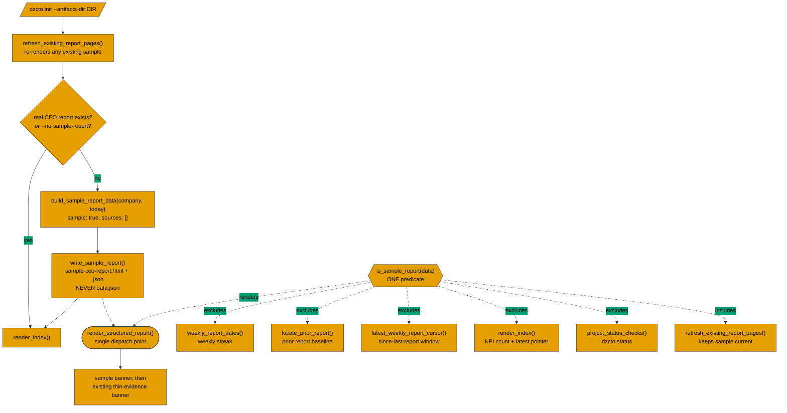

# DAYZEROCTO-19: Generate a sample report on first run to reach value in minutes

## Goal

Have `dzcto init` write one clearly-labelled sample CEO report artifact into the new workspace, and
introduce a single `sample` marker on report JSON that every report-selecting surface honors so the
sample can never be counted, cited, or diffed as real evidence.

---

## Context

`dzcto init` (`scripts/dzcto.py` → `scripts/dzcto_artifact.py --init`) today creates
`.dzcto/config.json`, `reports/ceo-updates/`, `index.html`, and `settings.html`, then re-renders any
existing structured reports. It writes **no** report artifact, so the first-run workspace has nothing
to open.

The whole difficulty of this change is not writing a report — it is that six independent surfaces
read the `reports/ceo-updates/` globs and would each treat a sample as real work:

| # | Surface | File | Consequence if the sample leaks in |
| --- | --- | --- | --- |
| 1 | Weekly streak | `scripts/dzcto_artifact.py` `weekly_report_dates()` | Streak KPI reads 1 on a workspace with zero real reports |
| 2 | Prior report (week-over-week baseline) | `scripts/dzcto_artifact.py` `locate_prior_report()` | The user's **first real CEO report** diffs against fabricated data |
| 3 | Since-last-report window cursor | `scripts/dzcto.py` `latest_weekly_report_cursor()` | The first real window starts the day after a fictional `window.end`, silently dropping real days |
| 4 | Index KPI / latest pointer / card list | `scripts/dzcto_artifact.py` `render_index()` | "CEO reports: 1"; the sample becomes the primary card and `latest_href` |
| 5 | `dzcto status` | `scripts/dzcto.py` `project_status_checks()` | Reports "1 generated report(s)" and drops the "run a report" next-step |
| 6 | Format refresh | `scripts/dzcto_artifact.py` `refresh_existing_report_pages()` | This one **should** include the sample, so it stays on the current format |

Surface 2 is the sharpest: `locate_prior_report()` treats any unknown or absent `report_type` as
`ad_hoc`, so it gets **no** free exclusion from a `report_type` value alone. That is why this plan
uses an explicit `sample` marker rather than a new `report_type`.

A separate trap sits outside those six: `dzcto artifact --kind ceo-updates` with no `--data-file`
auto-loads `reports/ceo-updates/data.json` as its report data
(`scripts/dzcto_artifact.py`, the `auto_data_path` branch of `main()`). If the sample writes that
rolling latest-pointer, a later real run renders the sample's fabricated content under a real title.
**The sample path must never write `data.json`.**

### Institutional learnings that govern this change

- `docs/solutions/architecture-patterns/shared-predicate-guardrail-single-dispatch-point-2026-07-09.md`
  — one predicate, N consumers; place a report-wide guardrail at the single dispatch point rather
  than at the call sites of a shared helper; warn-and-annotate, never hard-fail. This is the
  governing pattern: six consumers, one `is_sample_report()`.
- `docs/solutions/conventions/rendering-a-home-dir-config-value-breaks-test-hermeticity-2026-07-23.md`
  — anything reading ambient state needs a default-argument injection seam at the point of
  computation. The sample window derives from `dt.date.today()`, so the builder takes `today=None`,
  mirroring the seam `render_index(wiki_root, project_folder, today=None)` already has.
- `docs/solutions/conventions/absence-proxy-assertions-break-on-additive-rendering-2026-07-23.md`
  — before adding rendered output to a section other tests assert over as a whole, grep those tests
  for `assertNotIn` on short strings. Applies to prepending a banner in `render_structured_report()`.
- `docs/solutions/architecture-patterns/helper-computes-agent-narrates-2026-07-03.md`
  — the deterministic helper computes the artifact; the skill only narrates the result.

### Sibling wiring precedent

The nearest same-kind feature already wired end-to-end is the **thin-evidence banner
(DAYZEROCTO-6)** — the only other report-wide marker derived from report JSON through one shared
predicate with several consumers. Its real touch-map is what the `## Completeness / Wiring Surfaces`
section below is derived from, surface for surface.

---

## Key Technical Decisions

- **Marker is `sample: true` on the report JSON, not a third `report_type`.** A new `report_type`
  would ripple into `CEO_REPORT_TYPES`, `validate_ceo_report()`, `docs/ceo-report-template.md`, and
  the two SKILL.md schema blocks pinned byte-identical by `TestSkillSchemaLockstep` — while still
  leaving `locate_prior_report()` unguarded, because it coerces unknown types to `ad_hoc`. An
  additive boolean guarded by one predicate is both smaller and stricter.
- **The sample keeps `report_type: "weekly"`.** Its job is to show what
  `/dzcto-ceo-report-weekly` produces. Exclusion is the predicate's job, not the type's.
- **The sample ships `sources: []`, so the existing thin-evidence banner fires.** Populating
  `sources` with plausible-looking entries would fabricate citations — the precise failure the issue's
  traceability constraint names. An empty array is schema-conformant (no
  `missing required field: sources` warning) while `cited_evidence_sources()` stays empty, so the
  honest "claims are not traceable to repo sources" banner renders alongside the sample banner.
- **Two banners, both true.** The sample banner renders above the thin-evidence banner in
  `render_structured_report()`, so "this is an example" is read before "no evidence cited."
- **Fixed filename stem `sample-ceo-report`, no ISO date prefix.** This makes the artifact
  self-identifying on disk and makes re-running init idempotent by path rather than by content hash.
  Its effective date still resolves through `window.end`, so ordering helpers keep working.
- **Written only into a workspace with no real CEO report; never deleted.** The sample exists for
  first-run value. Once real reports exist it is not created, and an existing one is left in place
  (still excluded everywhere, still badged) rather than deleted out from under the user.
- **Opt-out is `--no-sample-report`, an operator flag with no stored config key**, so it joins
  `TestSettingsFlagParity.INTENTIONALLY_UNDOCUMENTED` alongside `--no-save-preferences` rather than
  `INIT_REPORT_SETTING_FLAGS`. That test forces the decision to be explicit either way.
- **The sample runs through `sanitize_current_report_data()` like any other report**, because the
  company name it embeds comes from user config and the report artifact is an egress point.

---

## High-Level Technical Design

> *This illustrates the intended approach and is directional guidance for review, not implementation
> specification. The implementing agent should treat it as context, not code to reproduce.*

Shape legend: **parallelogram** = operator command · **diamond** = branch · **hexagon** = the shared
predicate · **stadium (rounded ends)** = the single render dispatch point · **rectangle** = a
function or step. Solid arrows are the init control flow; dashed arrows are predicate consumers,
labelled with whether the predicate *excludes*, *includes*, or *renders* for that surface.

---

## Completeness / Wiring Surfaces

Derived from the thin-evidence banner (DAYZEROCTO-6) touch-map. One checkable bullet per surface;
each names a concrete file and function.

- [ ] **Shared predicate** — `is_sample_report()` added in `scripts/dzcto_artifact.py` beside
      `cited_evidence_sources()`, plus a thin path adapter for the two surfaces that iterate HTML.
- [ ] **Banner renderer** — `render_sample_report_banner()` in `scripts/dzcto_artifact.py` beside
      `render_thin_evidence_banner()`.
- [ ] **Single dispatch point** — `render_structured_report()` in `scripts/dzcto_artifact.py`
      prepends the sample banner above the thin-evidence banner. Not inside `render_ceo_update()`
      or `render_sources()`; the condition is report-wide.
- [ ] **CSS** — a `.report-sample` block beside `.report-thin-evidence` in `base_css()`, plus the
      matching narrow-viewport override beside the existing `.report-thin-evidence` responsive rule.
- [ ] **Init write path** — the `args.init` branch of `main()` in `scripts/dzcto_artifact.py` calls
      the sample writer after `refresh_existing_report_pages()` and before `render_index()`.
- [ ] **Never writes the latest-pointer** — the sample writer does not touch
      `reports/ceo-updates/data.json` (guards the `auto_data_path` branch of `main()`).
- [ ] **Weekly streak** — `weekly_report_dates()` in `scripts/dzcto_artifact.py` skips samples.
- [ ] **Prior report** — `locate_prior_report()` in `scripts/dzcto_artifact.py` skips sample
      candidates, with a comment naming why unknown-type coercion makes this non-optional.
- [ ] **Since-last-report cursor** — `latest_weekly_report_cursor()` in `scripts/dzcto.py` skips
      samples.
- [ ] **Index** — `render_index()` in `scripts/dzcto_artifact.py` excludes samples from
      `report_count`, `latest_href`, and `latest_date`, and renders them as a distinct badged card.
- [ ] **`dzcto status`** — `project_status_checks()` in `scripts/dzcto.py` counts real reports only.
- [ ] **Format refresh** — `refresh_existing_report_pages()` in `scripts/dzcto_artifact.py`
      deliberately keeps re-rendering the sample; verify no exclusion was added there by reflex.
- [ ] **Opt-out flag parity** — `--no-sample-report` declared on the `init` subparser in
      `scripts/dzcto.py`, forwarded to `dzcto_artifact.py`, and added to
      `TestSettingsFlagParity.INTENTIONALLY_UNDOCUMENTED` in `tests/test_dzcto_artifact.py`.
- [ ] **Section spine lockstep** — confirm `TestReportSectionSpine` still passes and decide
      explicitly whether `docs/ceo-report-template.md`'s spine table needs an entry (the
      thin-evidence banner has none, which is the precedent).
- [ ] **Template schema** — `sample` documented in the schema table of
      `docs/ceo-report-template.md`, marked renderer-authored like `prior_report`.
- [ ] **Skill result text** — `skills/dzcto-init/SKILL.md` Result section names the sample path.
- [ ] **Install docs** — `README.md` and `INSTALL_FOR_AGENTS.md` describe the new init output.
- [ ] **Domain vocabulary** — `CONCEPTS.md` gains a "Sample report" entry under Reports.
- [ ] **Release surfaces** — all five version fields bumped (see U4).

---

## Files

**Create**
- No new source files. The sample writer, predicate, and banner all belong beside their existing
  siblings in `scripts/dzcto_artifact.py`; a new module would split the one-predicate contract
  across two files.

**Modify**
- `scripts/dzcto_artifact.py` — predicate, path adapter, sample data builder, sample writer, banner
  renderer + CSS, dispatch point, `weekly_report_dates()`, `locate_prior_report()`, `render_index()`,
  `main()` init branch and `--no-sample-report` arg
- `scripts/dzcto.py` — `latest_weekly_report_cursor()`, `project_status_checks()`, `init` subparser
  flag and forwarding
- `docs/ceo-report-template.md` — schema table row for `sample`, short subsection
- `skills/dzcto-init/SKILL.md` — Result section
- `README.md` — What Init Captures / init output
- `INSTALL_FOR_AGENTS.md` — init output description
- `CONCEPTS.md` — "Sample report" entry
- `AGENTS.md` — editing rule for the sample artifact (only if the rule set needs it)
- `.claude-plugin/plugin.json`, `.codex-plugin/plugin.json`, `.claude-plugin/marketplace.json`,
  `scripts/dzcto_common.py` — five version fields

**Test**
- `tests/test_dzcto_artifact.py` — all new coverage; also update
  `TestSettingsFlagParity.INTENTIONALLY_UNDOCUMENTED` and audit `TestArtifactWritePath` /
  `test_init_refreshes_existing_structured_reports_without_rewriting_json`, which shell out to init
  and will now also produce a sample

---

## Plan

### U1. Sample CEO report renders on init, end to end

**Goal:** `dzcto init` against an empty folder produces an openable, visibly-labelled sample report
artifact.

**Dependencies:** None.

**Files:**
- Modify: `scripts/dzcto_artifact.py`
- Modify: `scripts/dzcto.py`
- Test: `tests/test_dzcto_artifact.py`

**Approach:**
- Add `SAMPLE_REPORT_STEM` and `is_sample_report(data)` beside `cited_evidence_sources()`; the
  predicate is over report **data**, matching the DAYZEROCTO-6 pattern. Add one thin adapter that
  resolves an HTML path to its sibling JSON for the two surfaces that iterate HTML (U2/U3).
- Add `build_sample_report_data(company, today=None)` with the injection seam. Derive the window
  deterministically from `today` (the completed 7-day period ending the day before the run date) so
  the artifact demonstrates a realistic weekly window without reading the clock untestably. Set
  `report_type: "weekly"`, `sample: true`, `sources: []`, and illustrative
  `headline` / `progress` / `risks_blockers` / `asks_decisions` / `next` / `metrics` content whose
  own text says it is an example.
- Add `write_sample_report(wiki_root, company, stable_title, *, today=None)` mirroring the real
  write path in `main()`: sanitize, render via `render_structured_report()`, wrap with
  `render_report_page()`, write `sample-ceo-report.html` and its sibling `.json`, build provenance
  with a `sample` marker in `extra`, and `update_manifest()`. It writes **no** `data.json`. Return
  `None` when skipped.
- Guard clauses: skip when `--no-sample-report` was passed; skip when the folder already contains a
  non-sample report JSON/HTML; skip when the sample already exists (the earlier
  `refresh_existing_report_pages()` call has already re-rendered it).
- Add `render_sample_report_banner()` beside `render_thin_evidence_banner()`, plus `.report-sample`
  CSS beside `.report-thin-evidence` in `base_css()` and the matching narrow-viewport override.
  Prepend it in `render_structured_report()` **above** the thin-evidence banner.
- Wire the call into the `args.init` branch of `main()`, after the refresh and before
  `render_index()`. Add `--no-sample-report` to both parsers and forward it from `scripts/dzcto.py`.

**Execution note:** Before adding the banner, grep `tests/test_dzcto_artifact.py` for `assertNotIn`
over `render_structured_report()` output (`TestThinEvidenceRendering`,
`test_populated_ceo_report_has_no_empty_placeholders`, `TestCeoQuietWindowRendering`) and confirm no
short-string sentinel is tripped, per the absence-proxy learning. Choose banner wording that avoids
existing sentinels rather than relaxing an assertion.

**Patterns to follow:**
- `render_thin_evidence_banner()` + its dispatch in `render_structured_report()` — the banner shape.
- The real report write block in `main()` — provenance, sanitize, manifest ordering.
- `render_index(wiki_root, project_folder, today=None)` — the `today` seam.

**Test scenarios:**
- Happy path: `build_sample_report_data("Acme", today=<fixed date>)` returns `sample is True`,
  `report_type == "weekly"`, `sources == []`, and a `window` whose `end` precedes `today`.
- Happy path: init against an empty temp folder writes `reports/ceo-updates/sample-ceo-report.html`
  and `.json`; the HTML contains the sample banner text.
- Happy path: the rendered sample also carries the existing thin-evidence banner, and the sample
  banner appears **before** it in the document.
- Edge case: init writes **no** `reports/ceo-updates/data.json`.
- Edge case: running init twice produces exactly one `sample-ceo-report.html` and does not duplicate
  or append.
- Edge case: init against a folder that already holds a real CEO report writes no sample.
- Edge case: `dzcto init --no-sample-report` writes no sample.
- Edge case: a company name carrying a low-confidence secret shape is redacted in the sample, like
  any other report artifact.
- Integration: `render_structured_report()` on a non-sample report renders no sample banner
  (the marker, not the code path, is what gates it).

**Verification:** `dzcto init --artifacts-dir <tmp>` on a fresh folder produces a sample report that
opens in a browser with correct chrome, breadcrumbs, and stylesheet, and reads unmistakably as an
example.

---

### U2. The sample can never be counted, cited, or diffed as real evidence

**Goal:** every evidence-bearing selection surface skips the sample.

**Dependencies:** U1.

**Files:**
- Modify: `scripts/dzcto_artifact.py`
- Modify: `scripts/dzcto.py`
- Test: `tests/test_dzcto_artifact.py`

**Approach:**
- `weekly_report_dates()` — skip samples before the `report_type` filter (defense in depth: the
  sample *is* `weekly`).
- `locate_prior_report()` — skip sample candidates in the glob loop, with a comment stating that
  unknown-type coercion to `ad_hoc` means this exclusion cannot be inherited from `report_type`.
- `latest_weekly_report_cursor()` in `scripts/dzcto.py` — skip samples; `scripts/dzcto.py` already
  imports from `dzcto_artifact`, so the predicate import direction works.
- `project_status_checks()` in `scripts/dzcto.py` — count only non-sample HTML, so the "CEO reports"
  check keeps its `warn` status and its "Run /dzcto-ceo-report-weekly" next-step on a fresh install.
- Explicitly leave `refresh_existing_report_pages()` unfiltered, with a comment saying so, so a
  later reader does not "fix" it into silence.

**Patterns to follow:**
- The `data.get("report_type") != "weekly"` skip already present in `weekly_report_dates()` and
  `latest_weekly_report_cursor()` — same shape, same stderr-quiet style (a sample is expected, not
  an anomaly, so it should not emit a skip note).

**Test scenarios:**
- Happy path: a workspace holding only the sample yields `weekly_report_dates() == []` and a weekly
  streak of 0.
- Happy path: the first real CEO report written into a workspace holding a sample renders
  "First report — no prior baseline", not a diff against the sample.
- Happy path: `latest_weekly_report_cursor()` returns `None` when only a sample exists, so
  `resolve_since_last_report_window()` reports `fallback` / `no_prior_weekly_report`.
- Happy path: `dzcto status` on a sample-only workspace reports no generated reports and keeps its
  next-step command.
- Edge case: with one sample **and** one real weekly present, the real weekly is selected as the
  prior report and counts toward the streak.
- Edge case: a report JSON with `sample: false` or no `sample` key is treated as real
  (the marker is strictly opt-in).
- Integration: `refresh_existing_report_pages()` still re-renders the sample on a later init and
  reports it in its refreshed count.

**Verification:** on a workspace containing only the sample, the streak KPI is 0, `dzcto window`
reports no cursor, `dzcto status` says no reports generated, and the first real report claims no
prior baseline.

---

### U3. The index surfaces the sample honestly

**Goal:** the index counts zero real reports on a fresh install while still giving the user something
to open, clearly badged.

**Dependencies:** U1, U2.

**Files:**
- Modify: `scripts/dzcto_artifact.py`
- Test: `tests/test_dzcto_artifact.py`

**Approach:**
- In `render_index()`, partition the `*.html` glob into sample and real using the U1 path adapter.
- `report_count`, `latest_href`, and `latest_date` derive from **real** reports only, preserving the
  existing zero-report semantics on a fresh install.
- Reports section: keep the existing "Start here" empty-state card when there are no real reports,
  and render the sample as an additional card with its own role label and a `report-sample` class so
  it is visually distinct. When real reports exist, real cards come first and the sample card last —
  it must never win the `report-primary` slot.
- Include the sample's badge text in its `data-search-text` so index search finds it as a sample.
- Add the `.report-sample` card CSS beside the existing `.report` rules.

**Patterns to follow:**
- The existing report-card and empty-state markup in `render_index()`.
- `TestRenderIndexWeeklyStreak` / `TestRenderIndexConfigPanel` for index-render test structure and
  the `read_global_config` patch those suites use for hermeticity.

**Test scenarios:**
- Happy path: index of a sample-only workspace shows a CEO-reports KPI of 0 and still renders a
  badged sample card linking to `reports/ceo-updates/sample-ceo-report.html`.
- Happy path: with two real reports plus a sample, the KPI reads 2, the newest real report holds the
  `report-primary` class, and the sample card renders last.
- Edge case: `latest_href` and `latest_date` never point at the sample.
- Edge case: an index rendered for a workspace with real reports and no sample is byte-comparable to
  today's output for the report section (no gratuitous markup drift).
- Edge case: a sample HTML whose sibling JSON is missing or corrupt is treated as a real report
  rather than crashing the index render (fail-safe direction matches
  `test_malformed_json_does_not_block_index_write`).
- Integration: `dzcto status` and the index agree on the report count for the same workspace.

**Verification:** `index.html` on a fresh init shows 0 CEO reports, a 0 weekly streak, and one
clearly-labelled sample card that opens the sample report.

---

### U4. Docs, skill, vocabulary, and release surfaces

**Goal:** the documented contract matches the shipped behavior, and installs pick up the change.

**Dependencies:** U1, U2, U3.

**Files:**
- Modify: `docs/ceo-report-template.md`
- Modify: `skills/dzcto-init/SKILL.md`
- Modify: `README.md`
- Modify: `INSTALL_FOR_AGENTS.md`
- Modify: `CONCEPTS.md`
- Modify: `AGENTS.md` (only if a new editing rule is warranted)
- Modify: `.claude-plugin/plugin.json`, `.codex-plugin/plugin.json`,
  `.claude-plugin/marketplace.json`, `scripts/dzcto_common.py`
- Test: `tests/test_dzcto_artifact.py`

**Approach:**
- `docs/ceo-report-template.md`: add a `sample` row to the schema-v1 table (optional boolean,
  renderer-authored like `prior_report`, "do not author this field"), and a short subsection stating
  that a sample artifact is excluded from prior-report selection, the weekly streak, the
  since-last-report cursor, and every report count. Take care not to disturb the
  `## Section spine (fixed, in order)` table, which `TestReportSectionSpine` parses.
- `skills/dzcto-init/SKILL.md`: extend the Result section to name the generated sample path and say
  plainly that it is an example. Do not copy any `INIT_REPORT_SETTING_FLAGS` description text —
  `test_skill_doc_points_at_the_generated_page_instead_of_copying_it` forbids it.
- `README.md` / `INSTALL_FOR_AGENTS.md`: describe the sample in the init-output description, per the
  AGENTS.md rule that install behavior changes update both.
- `CONCEPTS.md`: add a **Sample report** entry under Reports, defined against the existing
  "report artifact" and "prior report" terms.
- Bump all five version fields 0.9.3 → 0.9.4 across the four release surfaces, matching commit
  `8c9ae39` (DAYZEROCTO-13) exactly.

**Test scenarios:**
- Happy path: the template's schema table documents `sample`, and a test asserts the field name
  appears there (guarding renderer/doc drift the way the existing lockstep tests do).
- Happy path: `TestSettingsFlagParity` passes with `--no-sample-report` recorded in
  `INTENTIONALLY_UNDOCUMENTED`, and `test_undocumented_flags_are_an_enumerated_decision` still
  produces an exact-set match.
- Edge case: `TestReportSectionSpine::test_spine_constant_matches_template_sections` still passes
  after the template edit.
- Edge case: `dzcto version` reports 0.9.4 and the rendered index footer shows the same value.
- Integration: JSON manifests parse after the version bump.

**Verification:** the full suite is green, `dzcto doctor` passes, `dzcto version` reports 0.9.4, and
a reader of `docs/ceo-report-template.md` can tell exactly what `sample` does without reading code.

---

## Tests

Full-suite command (AGENTS.md): `python3 -m unittest discover -s tests`.

- **Predicate:** `is_sample_report()` over `sample: true` / `sample: false` / missing key /
  non-dict input.
- **Builder hermeticity:** `build_sample_report_data(company, today=<fixed>)` is deterministic; two
  calls with the same `today` produce the same window. Add one test proving the `today` seam is
  load-bearing (mirrors
  `test_default_profile_reads_the_global_config_through_the_injection_seam`).
- **Init write path:** artifact created / not duplicated / suppressed by real reports / suppressed by
  `--no-sample-report` / never writes `data.json`.
- **Rendering:** sample banner present, ordered above the thin-evidence banner, absent on non-sample
  reports; existing `TestThinEvidenceRendering` and `TestCeoQuietWindowRendering` still green.
- **Exclusions:** one test per surface — `weekly_report_dates()`, `locate_prior_report()`,
  `latest_weekly_report_cursor()`, `render_index()` KPI/latest, `project_status_checks()` — plus one
  positive test that `refresh_existing_report_pages()` still includes the sample.
- **Regression audit:** re-run `TestArtifactWritePath` and
  `test_init_refreshes_existing_structured_reports_without_rewriting_json`, which shell out to init
  and will now also emit a sample. Update assertions that count reports or glob the folder; prefer
  tightening them to name what they mean over passing `--no-sample-report` to hide the new artifact.
- **Hermeticity retrofit:** any new index-render test patches `artifact.read_global_config`, as
  `TestRenderIndexConfigPanel` does.

Additional validation from AGENTS.md:
- `python3 -m py_compile scripts/dzcto_artifact.py scripts/dzcto.py scripts/dzcto_common.py`
- Smoke-test `dzcto init --artifacts-dir <temp folder>` and open the result (leave this run
  unpatched — its job is to exercise the real environment).
- Validate the JSON manifests after the version bump.

---

## System-Wide Impact

- **Interaction graph:** one new artifact in `reports/ceo-updates/` is read by six existing
  consumers; the predicate is the only thing standing between it and each of them.
- **Error propagation:** every guardrail here is warn-and-annotate. A missing or corrupt sample JSON
  must degrade to "treat as real report" or "skip", never to a crashed index render.
- **State lifecycle risks:** the sample must never become the rolling `data.json` latest-pointer, and
  must never be deleted by the tool.
- **API surface parity:** `--no-sample-report` must exist on both `scripts/dzcto.py`'s `init`
  subparser and `scripts/dzcto_artifact.py`'s parser, or the wrapper forwards an unknown flag.
- **Integration coverage:** the index KPI, `dzcto status`, and `dzcto window` must all agree that a
  sample-only workspace has zero real reports — that agreement is what the shared predicate buys.
- **Unchanged invariants:** the report JSON schema stays v1 (`sample` is additive and optional);
  `CEO_REPORT_TYPES` is unchanged; the section spine is unchanged; real-report rendering,
  prior-report selection among real reports, and streak arithmetic are all untouched.

---

## Risks & Dependencies

| Risk | Mitigation |
| --- | --- |
| A seventh reader of the reports glob is added later and forgets the predicate | Keep the predicate the single documented gate, name every consumer in the template doc, and add a test per consumer so a new one is an obvious omission |
| Existing init-shelling tests silently absorb the new artifact and lose meaning | U4 audits `TestArtifactWritePath` and the init-refresh test explicitly; tighten assertions rather than suppressing the sample |
| The banner trips an absence-proxy assertion elsewhere in the suite | U1 execution note requires grepping for `assertNotIn` sentinels before choosing banner wording |
| A user mistakes the sample for real work despite the badge | Three independent signals — the sample banner, the existing thin-evidence banner, and a zero report count on the index |
| Concurrent branch `dayzerocto-15-feature-exclude-no-work-and-discarded-runs-from` also edits `weekly_report_dates()` / streak selection | Both branch from the same base; expect a small merge conflict in the streak filter and keep this change to a single additional skip line so it rebases cleanly |

---

## Open Questions

### Resolved during planning

- *New `report_type` vs. a `sample` boolean?* — Boolean. A new type would not exclude the sample
  from `locate_prior_report()` (which coerces unknown types to `ad_hoc`) while still forcing schema
  and doc churn.
- *Should the sample cite sources?* — No. `sources: []` keeps it schema-conformant and lets the
  existing thin-evidence banner tell the truth instead of fabricating citations.
- *Delete the sample once real reports exist?* — No. Do not delete user files; suppress creation and
  keep it excluded and badged.
- *Where does the opt-out flag live in the parity contract?* — `INTENTIONALLY_UNDOCUMENTED`; it is an
  operator flag with no stored config key, like `--no-save-preferences`.

### Deferred to implementation

- Exact sample copy (headline, progress items, metric labels). Should read as an obvious example
  while still demonstrating the tone guidance; settle it while looking at rendered output.
- Whether the sample card warrants its own CSS treatment or can reuse the existing empty-state card
  styling — decide against the rendered index, not in the abstract.
- Whether `AGENTS.md` needs a new editing rule for the sample artifact, or whether the template doc
  entry is sufficient.
- Precise resolution of the merge with `dayzerocto-15-feature-exclude-no-work-and-discarded-runs-from`
  if that branch lands first.

---

## Sources & References

- Backlog issue: DAYZEROCTO-19 (owns the acceptance criteria)
- `docs/ceo-report-template.md` — canonical report contract
- `docs/solutions/architecture-patterns/shared-predicate-guardrail-single-dispatch-point-2026-07-09.md`
- `docs/solutions/conventions/rendering-a-home-dir-config-value-breaks-test-hermeticity-2026-07-23.md`
- `docs/solutions/conventions/absence-proxy-assertions-break-on-additive-rendering-2026-07-23.md`
- `docs/solutions/architecture-patterns/helper-computes-agent-narrates-2026-07-03.md`
- Prior version-bump precedent: commit `8c9ae39` (DAYZEROCTO-13), five fields across four files
